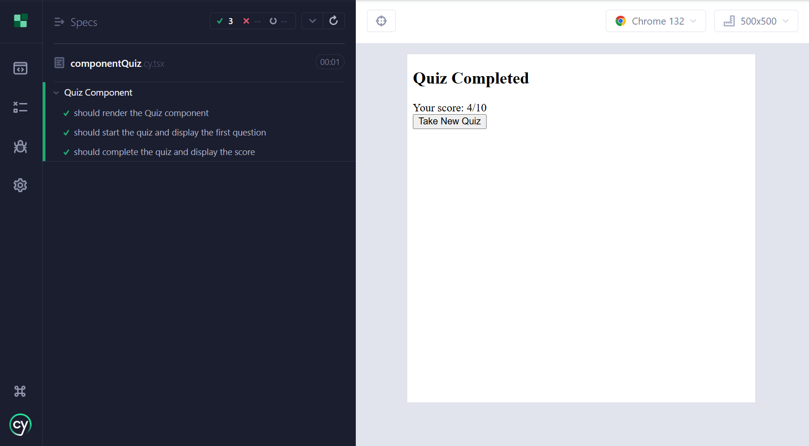

# Tech Quiz Test Suite


## Description

The Tech Quiz Test Suite is a web application that allows users to take a tech quiz to test their knowledge and improve their skills. The app provides a consistent navigation experience across all pages with a fixed navigation bar.

## Table of Contents

- [Installation](#installation)
- [Usage](#usage)
- [Testing](#testing)
- [Features](#features)
- [Walkthrough Video](#walkthrough-video)
- [Technologies Used](#technologies-used)
- [License](#license)
- [Contributing](#contributing)
- [Questions](#questions)

## Installation

1. Clone the repository:
   ```bash
   git clone https://github.com/pink727/tech-quiz-test-suite.git
   ```
2. Navigate to the project directory:
   ```bash
   cd tech-quiz-test-suite
   ```
3. Install the dependencies:
   ```bash
   npm install
   ```

## Usage

1. Start the development server:
   ```bash
   npm run start:dev
   ```
2. Open your browser and navigate to `http://localhost:3000`.

## Testing

This project uses Cypress for both component and end-to-end testing. To run the tests, follow these steps:

1. Open a terminal and navigate to the project directory.
2. Run the Cypress tests:
   ```bash
   npm run test
   ```
3. To open the Cypress Test Runner for interactive testing:
   ```bash
   npm run cypress:open
   ```
### Component Test



### e2e Test


The tests are located in the `cypress` directory:
- Component tests: `cypress/component/`
- End-to-end tests: `cypress/e2e/`
- Test fixtures: `cypress/fixtures/`


## Walkthrough Video

[Watch the Walkthrough Video](https://www.youtube.com/watch?v=s1wiUKYsbw4)


## Features

- Take a tech quiz with random questions.
- Comprehensive testing with Cypress.


## Technologies Used

- React
- TypeScript
- React Router
- Cypress
- Express
- MongoDB
- Mongoose

## License

This project is licensed under the [MIT License](https://opensource.org/license/mit).

## Contributing

Base files were provided by © 2024 edX Boot Camps

## Questions

For any questions, please contact me with the information below:

GitHub: [Pink727](https://github.com/pink727)

Email: doc72789@gmail.com

____________________________________
© 2025 Pink727. All Rights Reserved.
